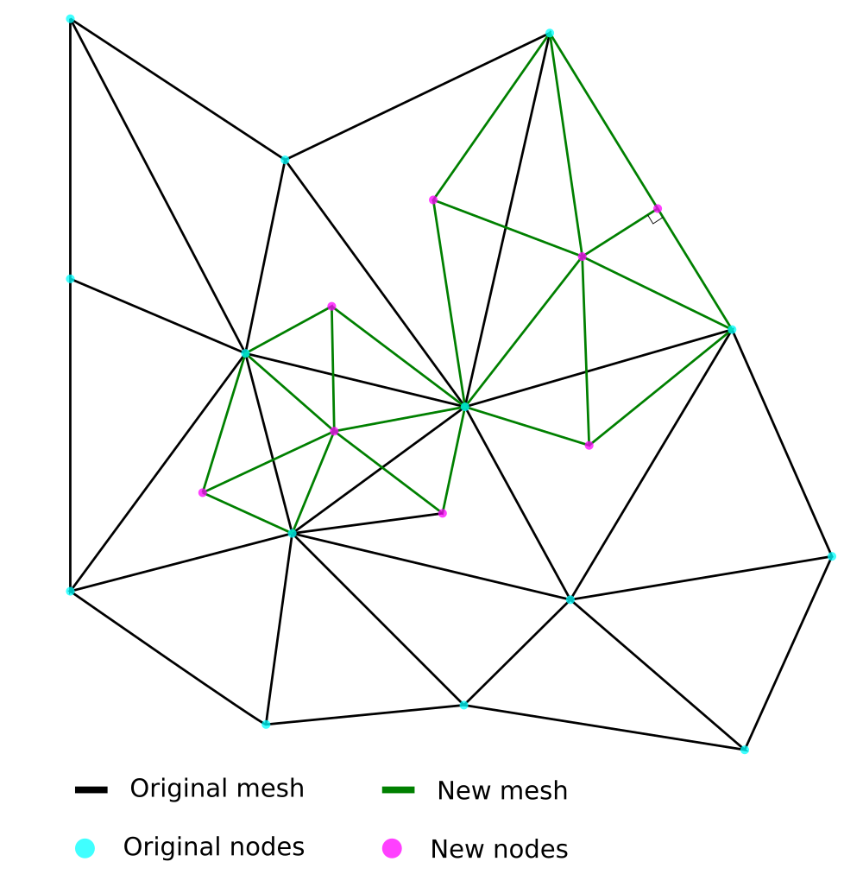
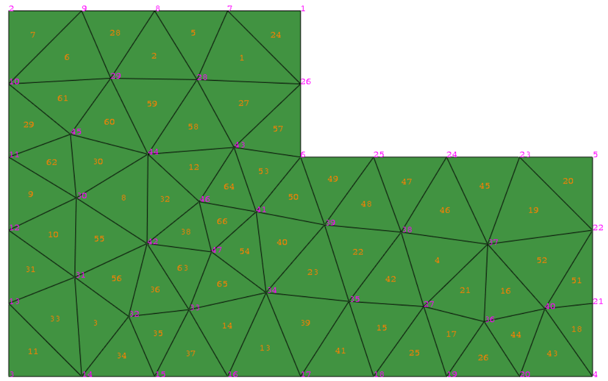
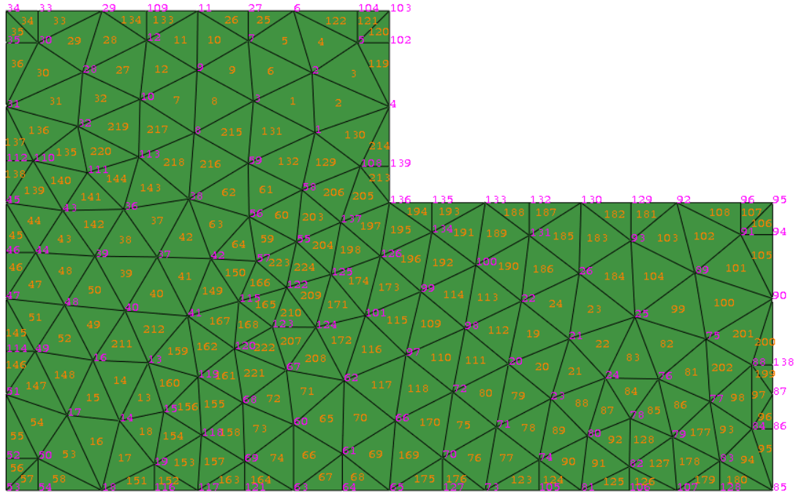

# meshRefiner
Abaqus add-on to refine a shell tridimensional orphan mesh.

## Concept

Use the existing mesh as long as the element centers to generate a refined mesh.

## Results from the initial script

Start and final meshes.

